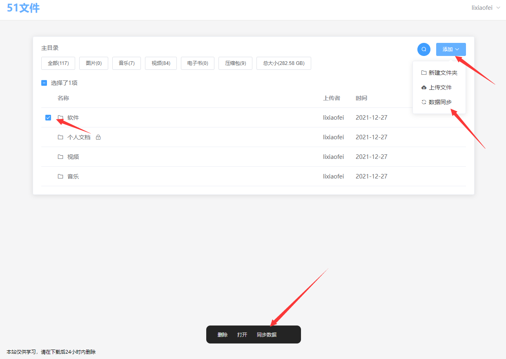

[](https://github.com/lixiaofei123/nextlist/actions/workflows/docker-master.yml)  [](https://github.com/lixiaofei123/nextlist/actions/workflows/release.yaml)  [](https://github.com/lixiaofei123/nextlist/actions/workflows/docker-stable.yml)


**NextList** 下一个列表程序。

演示地址 [https://demo.326256.xyz](https://demo.326256.xyz)。演示地址使用Onedriver作为存储。

目前支持的存储有

 - [x] 对象存储
 - [x] 本地文件系统
 - [x] 阿里云盘 (alidriver存储的代码主要来自于[Alist](https://github.com/Xhofe/alist))
 - [x] OneDriver

目前支持的功能有
 - [x] 多用户
 - [x] 查看目录以及下载文件
 - [x] 部分文件格式在线预览
 - [x] 文件上传以及删除
 - [x] 文件夹设置私有或者密码

 下个版本预计支持的功能有
 - [ ] 多存储支持
 - [ ] WebDav支持
 - [ ] 夜间模式
 - [ ] 更多格式文件的预览
 - [ ] Onedriver世纪互联(暂时没有账号)


## 部署说明

**NextList** 使用前后端分离架构，另外还依赖了MYSQL(MariaDB)数据库。因此，需要分别部署数据库、后端程序、以及前端服务

### Docker部署

请在部署前自行安装Docker容器

#### 启动MariaDB

首先用下面的命令创建MariaDB容器

```
docker run --restart=always --name nextlist_db    -v /data/db/nextlist:/var/lib/mysql -e MARIADB_ROOT_PASSWORD=nextlist -e MARIADB_USER=nextlist -e MARIADB_PASSWORD=nextlist  -e MARIADB_DATABASE=nextlist -d mariadb
```

#### 启动后端服务

在启动后端服务时，需要先进行配置。

配置文件如下

```yaml
port: 8081
database:
  mysql:
    url: nextlist_db
    port: 3306
    database: nextlist
    username: nextlist
    password: nextlist
driver: 
  name: file
  config: 
    path: "/data/nextlist"
    key: "xxxxx"  
    host: http://ip:port
    selfDownload: true 
#   name: alidriver        
#   config:
#     refreshToken: xxxxxxxx
#     key: "xxxxxxxxx"
#     host: http://ip:port
#     rootID: xxxxxxxxx
  # name: onedriver
  # config:
  #   refreshToken: "xxxxxxxxxxxxx"
  #   clientID: "xxxxxxxx"
  #   clientSecret: "xxxxxxxx"
  #   redirectUrl: "https://tool.nn.ci/onedrive/callback"
  #   key: "xxxxxxxxxxxxxxxxxxx"
  #   path: /nextlist
  #   host:  http://ip:port
  # name: s3
  # config:
  #   secretID: xxxxxx
  #   secretKey: xxxxxx
  #   region: us-west-002
  #   endpoint: https://s3.us-west-002.backblazeb2.com
  #   bucket: mybucket
  download: 
    - title: 测试线路1
      url: https://a.nextlict.com
    - title: 测试线路2
      url: https://a.nextlict.com
site:
  title: "NextList"
  copyright: "本站资料仅供学习使用，请在下载后24小时内删除"
  allowRegister: false
auth:
  secret: "xxxxxxxx"
```


配置说明

| 参数 | 说明 |
| ---- | ---- |
| port | 后端服务使用的端口号，如果使用Docker部署，此端口必须是8081。 |
| database | 根据实际情况填写。如果是按照上面的步骤启动的mysql，则无需修改 |
| driver.name | 使用的存储类型，目前支持file、alidriver、onedriver、s3 |
| driver.config | 存储所需的配置信息，参考下文中各自具体的配置说明 |
| download | 多下载线路支持，仅对s3以及file存储生效，此模式下，前端会显示多个下载地址，且下载地址由url和path拼接而成，例如某线路配置的url为https://nextlist.com,则该线路路径为/a/b/c/png的下载地址为https://nextlist.com/a/b/c/png,此路径由你来确保可以访问 |
| site.title | 站点名称，不填写默认显示nextlist的LOGO |
| site.copyright | 版权声明，显示在页面左下角，支持HTML |
| site.allowRegister | 站点是否允许注册，目前建议设置为false。即使设置了false，当数据库中没有用户时，仍然可以在前端注册，并且在注册成功后自动关闭注册入口 |
| auth.secret | 登录需要的密钥，随意填写 |


driver.config的配置说明如下

**文件存储配置**

本配置在driver.name为file的时候生效

| 参数 | 说明 |
| ---- | ---- |
| path | 存储路径 |
| key | 部分接口所需要使用的签名key，随意填写 |
| host | 后端服务的公网访问地址以及端口(如果是默认端口可以不填写) |
| selfDownload | 是否由nextlist后端程序提供下载服务 |


**alidriver**

本配置在driver.name为alidriver的时候生效。如果需要使用**NextList**的页面上传功能，请尽量使用阿里云的服务器，同时上传速度受限于服务器的出口带宽。

> alidriver存储的代码主要来自于[Alist](https://github.com/Xhofe/alist)

| 参数 | 说明 |
| ---- | ---- |
| refreshToken | 阿里云盘的refreshToken |
| key | 部分接口所需要使用的签名key，随意填写 |
| host | 后端服务的公网访问地址以及端口(如果是默认端口可以不填写) |
| rootID | 阿里云盘要使用的文件夹的ID |

refreshToken以及rootID的获取方法请[参考这里](https://alist-doc.nn.ci/docs/driver/aliyundrive)


**onedriver**

本配置在driver.name为onedriver的时候生效


| 参数 | 说明 |
| ---- | ---- |
| refreshToken | 阿里云盘的refreshToken |
| clientID | 注册的应用的ID |
| clientSecret | 应用密钥 |
| redirectUrl | 跳转地址，暂时固定为https://tool.nn.ci/onedrive/callback，如果会自己配置的话，也可以自己配置 |
| path | 要作为列表的onedriver的目录 |
| key | 部分接口所需要使用的签名key，随意填写 |
| host | 后端服务的公网访问地址以及端口(如果是默认端口可以不填写) |

上述相关参数的获取方法请[参考这里](https://alist-doc.nn.ci/docs/driver/onedrive)

**S3**

本配置在driver.name为s3的时候生效，开发阶段主要使用backblaze进行测试，理论上支持所有兼容S3协议的对象存储。

| 参数 | 说明 |
| ---- | ---- |
| secretID | 对象存储的密钥ID |
| secretKey | 对象存储的密钥Key |
| region | 区域 |
| endpoint | endpoint地址 |
| bucket | bucket名称 |


根据要求配置好配置文件后，启动NextList后端服务

下面以onedriver存储为例

在 /data/nextlist目录下创建config.yaml文件，内容如下

```
port: 8081
database:
  mysql:
    url: nextlist_db
    port: 3306
    database: nextlist
    username: nextlist
    password: nextlist
driver: 
  name: onedriver
  config:
    refreshToken: "xxxxxxxxxxxxx"   # 请替换为正确的refreshToken
    clientID: "xxxxxxxx"            # 请替换为正确的clientID
    clientSecret: "xxxxxxxx"        # 请替换为正确的clientSecret
    redirectUrl: "https://tool.nn.ci/onedrive/callback"
    key: "nextlist123"
    path: /nextlist
    host:  http://192.168.4.105:8081
site:
  title: "NextList"
  copyright: "本站资料仅供学习使用，请在下载后24小时内删除"
  allowRegister: false
auth:
  secret: "nextlist123"
```

然后启动NextList后端服务

```bash
docker run --detach  --name nextlist  --restart always --link  nextlist_db  -v /data/nextlist:/data mrlee326/nextlist -p 8081:8081  -c /data/config.yaml -d false
```

### 启动前端服务

如果看到这里，那就只差最后一步就可以完成了。最后启动前端服务

```
docker run --detach --name nextlist_web --restart always --env "APIURL=http://192.168.4.105:8081" -p 80:80 mrlee326/nextlist_web
```
> 请将http://192.168.4.105:8081换成所对应的后端地址。

至此基于全部配置完毕


## 使用说明

当配置完毕以后，打开http://ip:port就可以访问了。

如果看到下面的页面，且没有弹窗提示错误，则说明部署已经成功


默认情况下，NextList只能管理通过本页面创建或者上传的文件，对于不是通过NextList上传的文件，可以通过页面中的同步按钮来进行数据的同步。




