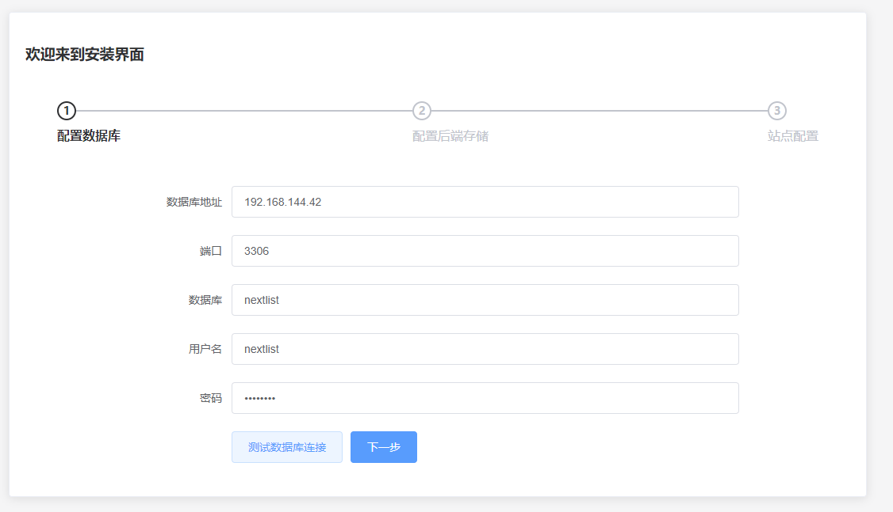
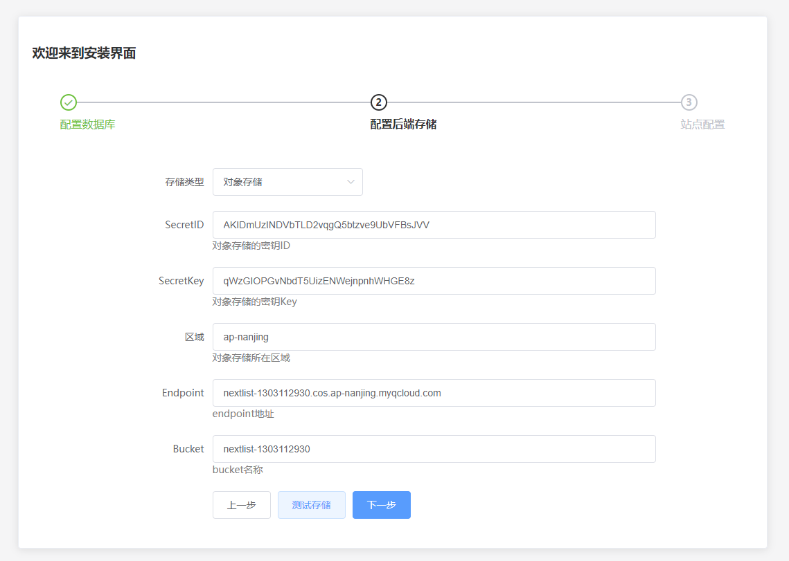
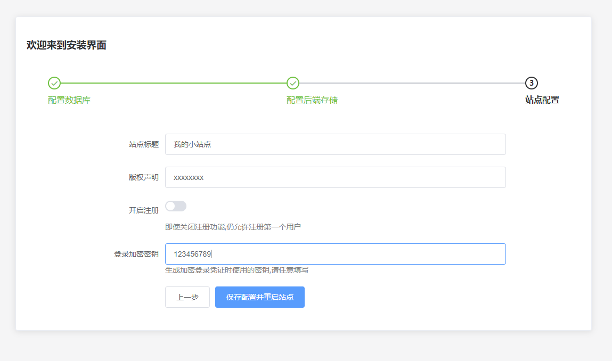
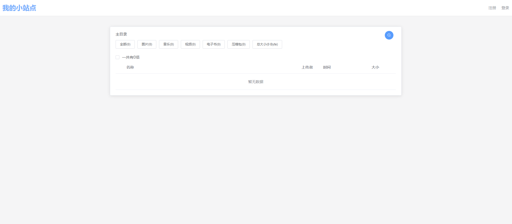

[](https://github.com/lixiaofei123/nextlist/actions/workflows/docker-master.yml)  [](https://github.com/lixiaofei123/nextlist/actions/workflows/release.yaml)  [](https://github.com/lixiaofei123/nextlist/actions/workflows/docker-stable.yml)


**NextList** 下一个列表程序。

目前支持的存储有

 - [x] 对象存储
 - [x] 本地文件系统
 - [x] OneDriver

目前支持的功能有
 - [x] 多用户
 - [x] 查看目录以及下载文件
 - [x] 部分文件格式在线预览
 - [x] 文件上传以及删除
 - [x] 文件夹设置私有或者密码


### 更新说明

1. 去除了对阿里云盘这种未提供官方接口的存储的支持
2. 将前端和后端打包在同一个Docker镜像中，方便部署
3. 将原来的文件配置方式修改为在页面上配置，对部署更友好。


## 部署说明

**NextList** 依赖了MYSQL(MariaDB)数据库。因此，需要先部署数据库再部署NextList


### Docker部署

请在部署前自行安装Docker容器

#### 启动MariaDB

首先用下面的命令创建MariaDB容器

```
docker run --restart=always --name nextlist_db    -v /data/db/nextlist:/var/lib/mysql -e MARIADB_ROOT_PASSWORD=nextlist -e MARIADB_USER=nextlist -e MARIADB_PASSWORD=nextlist  -e MARIADB_DATABASE=nextlist -d mariadb
```


#### 启动NextList

```
docker run -d --restart=always --name nextlist --link  nextlist_db -v  /data/nextlist/config:/app/config/ -p 8080:80 mrlee326/nextlist:v1.0.0
```

请务必将容器的/app/config/目录挂载在宿主机的某个路径下，否则配置可能会丢失。


## 使用说明

当配置完毕以后，打开http://ip:port就可以访问了。

### 第一次启动

第一次启动的时候，会自动进入到配置页面，请根据要求分别配置数据库、后端存储以及其它配置项





配置完毕后点击【保存配置并重启站点】，然后根据提示刷新页面即可。


如果上面的操作没出错的话，就可以访问到下面的页面了



默认情况下，NextList只能管理通过本页面创建或者上传的文件，对于不是通过NextList上传的文件，可以通过页面中的同步按钮来进行数据的同步。


